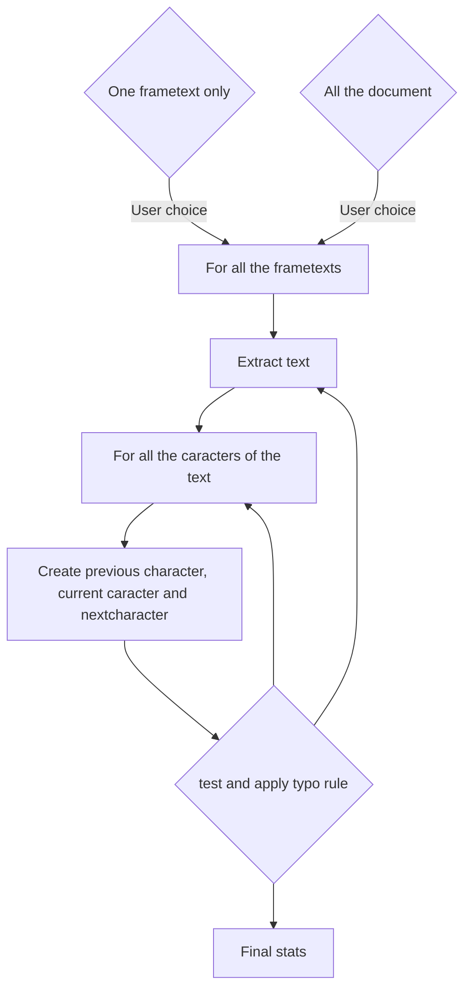

# Dev documentation

External doc for typoImprimerieNationale.py

This script has an internal documentation, but it could be a nice idea to read this documentation before for helping to understand the code.

You must be fluent with the Scribus API and Python.

# Internal code

## General principle

The general principle of this script is:

