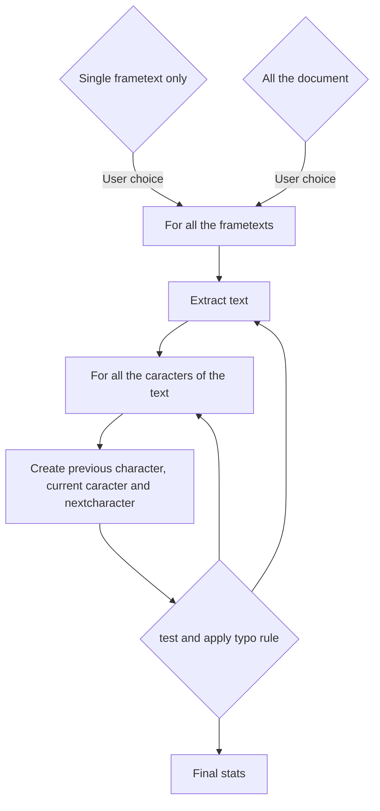

# Dev documentation

External doc for typoImprimerieNationale.py

This script has an internal documentation, but it could be a nice idea to read this documentation before for helping to understand the code.

You must be fluent with the Scribus API and Python.

# Internal code

## General principle

The general principle of this script is:



## Internal code

This script is based on the general Scribus structure template script you can find here:

https://wiki.scribus.net/canvas/Scripter/Snippet/Main

The script deals only on **frametext** and let the user to choose between working on a single frametext or on all over the document. This is enough difficult to propose an average, because Scribus API dialog structure is poor for dealing chooses.

### Welcome banner

Nothing special. It is a single message for indicating the purpose of the script.

The `welcome_banner()` function is simple message box given per the Scribus API

```python
def welcome_banner():
    #
    message_init = """<center>Ce script a pour but de forcer la tyographie du texte
    en respectant les normes recommandées par l'<b>Imprimerie nationale de France</b>.
    Il ne gère donc que les <font color=red>espacements</font>.
    <br><br> Si vous voulez transformer vos caractères en respectant les usages de France,
    comme les guillemets « ou », utilisez un autre script.
    <br><br>Pour poursuivre, cliquer sur OK</center>"""
    info("Message d'information")
    result = scribus.messageBox("Information",
                                message_init,
                                icon=ICON_INFORMATION,
                                button1=BUTTON_OK,
                                button2=BUTTON_ABORT|BUTTON_DEFAULT)
    if ( result == BUTTON_ABORT):
        sys.exit(1)
```


### Setup

If the user choose a single frametext, he must have selected it before using the script.

The `setup_script()` function checks it.

```python
    while True:
        message_setup = """<center>Appliquer la typographie</center>
        <ul> 1 : sur une zone de texte (à sélectionner à la souris auparavant)</ul>
        <ul> 2: sur tout le document (choix par défaut)</ul>
        <ul> 0 : pour quitter le processus</ul>"""
        flow = scribus.valueDialog("Domaine d'application", message_setup, "2")
        if flow == "2":
            workflow = "page"
            break
        if flow == "1":
            workflow = "frametext"
            break
        if flow == "0":
            sys.exit(1)
        else:
            message_warn = """<center>Vous devez répondre par 1 (zone de texte) <br>
            ou 2 (tout le document)</center>"""
            scribus.messageBox("Information",
                               message_warn,
                               icon=ICON_WARNING,
                               button1=BUTTON_OK)
```

Because the dialog boxes are poored, you cannot have check-button or all this sort of easy-to-configure buttons. The user must enter an figure by hand for its choice (here, "1" for a single frametext and "2) for all the document)

Now you have to check:

* if the user has selected a frame before running the script

```python
    if workflow == "frametext":
         # no selection
        if scribus.selectionCount() == 0:
            message_warn = """Aucun objet n'est sélectionné.\n
            Sélectionnez un cadre de texte et recommencez. """
            scribus.messageBox('Scribus - Erreur',
                               message_warn,
                               scribus.ICON_WARNING, scribus.BUTTON_OK)
            sys.exit(2)

```

* if the user has selected only *one* frame

```python
        elif scribus.selectionCount() > 1:
            message_warn = """<center>Ce script ne peut pas fonctionner 
            lorsque plusieurs objets sont sélectionnés.<br>
            Veuillez ne sélectionner qu'un seul cadre de texte, <br>
            puis recommencez.</center> """
            scribus.messageBox('Scribus - Erreur',
                               message_warn,
                               scribus.ICON_WARNING, scribus.BUTTON_OK)
            sys.exit(2)
```

* if the user has selected only a frametext

```python
        else:
            list_item = scribus.getPageItems() # [('Text1', 4, 0), ('Image1', 2, 1), ...]
            for item in list_item:
                if (item[1] != 4):
                    message_warn = """ L'objet sélectionné n'est pas un cadre de texte.\n
                    Veuillez sélectionner un cadre de texte, puis recommencez. """
                    scribus.messageBox('Scribus - Erreur',
                                       message_warn,
                                       scribus.ICON_WARNING, scribus.BUTTON_OK)
                    sys.exit(2)
```

Notice that a bad choice halts the script.

Don't forget that checks for Scribus internal use and opened Scribus document are done at the top of the code:

```python
try:
    import scribus
except ImportError:
    print("This Python script is written for the Scribus scripting interface.")
    print("It can only be run from within Scribus.")
    sys.exit(1)
```

To finish, in order to challenge the runtime, a counter get the start and final time with `datetime.now()` function and return the final runtime with the `process_time()`  function. They are classical time functions, nothing special with Scribus and this script.


### frametext main loop

The main work is done by the frametext loop. 


```python
```
```python
```
```python
```


