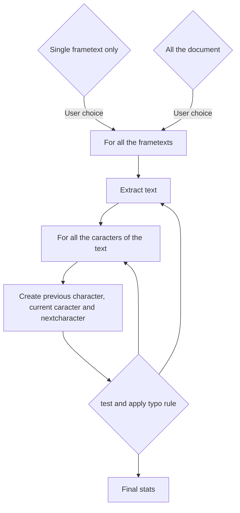

# Dev documentation

External doc for typoImprimerieNationale.py

This script has an internal documentation, but it could be a nice idea to read this documentation before for helping to understand the code.

You must be fluent with the Scribus API and Python.

https://impagina.org/scribus-scripter-api/

# Internal code

## General principle

The general principle of this script is:



## Internal code

This script is based on the general Scribus structure template script you can find here:

https://wiki.scribus.net/canvas/Scripter/Snippet/Main


The script deals only on **frametext** and let the user to choose between working on a single frametext or on all over the document. This is enough difficult to propose an average, because Scribus API dialog structure is poor for dealing chooses.

### Welcome banner

Nothing special. It is a single message for indicating the purpose of the script.

The `welcome_banner()` function is simple message box given per the Scribus API

```python
def welcome_banner():
    #
    message_init = """<center>Ce script a pour but de forcer la tyographie du texte
    en respectant les normes recommandées par l'<b>Imprimerie nationale de France</b>.
    Il ne gère donc que les <font color=red>espacements</font>.
    <br><br> Si vous voulez transformer vos caractères en respectant les usages de France,
    comme les guillemets « ou », utilisez un autre script.
    <br><br>Pour poursuivre, cliquer sur OK</center>"""
    info("Message d'information")
    result = scribus.messageBox("Information",
                                message_init,
                                icon=ICON_INFORMATION,
                                button1=BUTTON_OK,
                                button2=BUTTON_ABORT|BUTTON_DEFAULT)
    if ( result == BUTTON_ABORT):
        sys.exit(1)
```


### Setup

If the user choose a single frametext, he must have selected it before using the script.

The `setup_script()` function checks it.

```python
    while True:
        message_setup = """<center>Appliquer la typographie</center>
        <ul> 1 : sur une zone de texte (à sélectionner à la souris auparavant)</ul>
        <ul> 2: sur tout le document (choix par défaut)</ul>
        <ul> 0 : pour quitter le processus</ul>"""
        flow = scribus.valueDialog("Domaine d'application", message_setup, "2")
        if flow == "2":
            workflow = "page"
            break
        if flow == "1":
            workflow = "frametext"
            break
        if flow == "0":
            sys.exit(1)
        else:
            message_warn = """<center>Vous devez répondre par 1 (zone de texte) <br>
            ou 2 (tout le document)</center>"""
            scribus.messageBox("Information",
                               message_warn,
                               icon=ICON_WARNING,
                               button1=BUTTON_OK)
```

Because the dialog boxes are poored, you cannot have check-button or all this sort of easy-to-configure buttons. The user must enter an figure by hand for its choice (here, "1" for a single frametext and "2) for all the document)

Now you have to check:

* if the user has selected a frame before running the script

```python
    if workflow == "frametext":
         # no selection
        if scribus.selectionCount() == 0:
            message_warn = """Aucun objet n'est sélectionné.\n
            Sélectionnez un cadre de texte et recommencez. """
            scribus.messageBox('Scribus - Erreur',
                               message_warn,
                               scribus.ICON_WARNING, scribus.BUTTON_OK)
            sys.exit(2)

```

* if the user has selected only *one* frame

```python
        elif scribus.selectionCount() > 1:
            message_warn = """<center>Ce script ne peut pas fonctionner 
            lorsque plusieurs objets sont sélectionnés.<br>
            Veuillez ne sélectionner qu'un seul cadre de texte, <br>
            puis recommencez.</center> """
            scribus.messageBox('Scribus - Erreur',
                               message_warn,
                               scribus.ICON_WARNING, scribus.BUTTON_OK)
            sys.exit(2)
```

* if the user has selected only a frametext

```python
        else:
            list_item = scribus.getPageItems() # [('Text1', 4, 0), ('Image1', 2, 1), ...]
            for item in list_item:
                if (item[1] != 4):
                    message_warn = """ L'objet sélectionné n'est pas un cadre de texte.\n
                    Veuillez sélectionner un cadre de texte, puis recommencez. """
                    scribus.messageBox('Scribus - Erreur',
                                       message_warn,
                                       scribus.ICON_WARNING, scribus.BUTTON_OK)
                    sys.exit(2)
```

Notice that a bad choice halts the script.

Don't forget that checks for Scribus internal use and opened Scribus document are done at the top of the code:

```python
try:
    import scribus
except ImportError:
    print("This Python script is written for the Scribus scripting interface.")
    print("It can only be run from within Scribus.")
    sys.exit(1)
```

To finish, in order to challenge the runtime, a counter get the start and final time with `datetime.now()` function and return the final runtime with the `process_time()`  function. They are classical time functions, nothing special with Scribus and this script.


### frametext main loop

The main work is done by the frametext loop. The idea is simple. You get the entire string of text in the frametext and you work on it, character per character. Getting the string depends on the user choice:

* single frametext

```python
        text = scribus.getSelectedObject()
        textlen = scribus.getTextLength(text)
```

You get the object selected per the user, then you get the length of the text.

* all the document

You have to work page per page, by analysing all the objets in the page and keeping only the frametext object


```python
        pagenum = scribus.pageCount()  # page number   
        #
        while (page <= pagenum):
            scribus.gotoPage(page)
            list_item = scribus.getPageItems() # [('Text1', 4, 0), ('Image1', 2, 1), ...]
            for item in list_item:
                # must work only on the text
                if (item[1] == 4):  # 4 (= Text frame) of ('Text1', 4, 0)
                    text = item[0]  # Text1 of ('Text1', 4, 0)
                    # select all the text in current frame for couting characters
                    # use selectFrameText instead of getTextLength
                    # bug : getTextLength sends all the text from ALL the linked frames
                    #       if an object has not been selected!
                    #       textlen = scribus.getTextLength(text)
                    scribus.selectFrameText(0,-1,text)
                    contents = scribus.getFrameText(text)
                    textlen2 = len(contents)              # real text length to work
                    textlen = scribus.getTextLength(text) # whole text length over all the linked frames
```

Due to a strange behaviour of the returning value of the string if the frametexts are *linked*, I keep all the value for debuging. In reality, you can keep only the same function as the previous one for getting the length of the string.

Next, the loop is the same for the two approaches, except than you have to set at 0 the intial cursor each time you initialize a new loop for all the document.

The main loop is simple as possible:

```python
                    while c <= (textlen - 1):
                        # setup prevchar, char and nextchar
                        define_char(c, textlen, text)
                        # here, the job to do on characters...
                        # next character
                        c += 1
```
The first function you have to use is `define_char()`. It is setup the current character, previous and next one with the Scribus API:

```python
def define_char(cur, textlen, text):
    global char, prevchar, nextchar
    # Possible blank or almost-blank page!
    if textlen <= 1:
        prevchar = ''
        char = ''
        nextchar = ''
    else:    
        # 1st character
        if (cur == 0):
            prevchar = ''
            scribus.selectText(cur + 1, 1, text)
            nextchar = scribus.getText(text)
        # last character    
        if (cur == textlen - 1):
            nextchar = ''
            scribus.selectText(cur - 1, 1, text)
            prevchar = scribus.getText(text)
        # other characters
        if (cur > 0 and cur < textlen-1):
            scribus.selectText(cur - 1, 1, text)
            prevchar = scribus.getText(text)
            scribus.selectText(cur + 1, 1, text) 
            nextchar = scribus.getText(text)
        if (cur > textlen-1):
            print("ERROR: current text character pointer overflow!")
            sys.exit(1)
        scribus.selectText(cur, 1, text)
        char = scribus.getText(text)
```

This function deals all the possible cases, according to the lentgh of the string. It is based on the `geText()` and `selectText()` Scribus API functions.

### Typo functions

Typo functions are put into a tupple of couple functions, one for the test and the second for the modification:

```python
FR_typo_todo = ((FR_is_a_space, FR_remove_duplicated_spaces), \
                (FR_is_a_single, FR_typo_for_single), \
                (FR_is_a_double_thin, FR_typo_for_double_thin), \
                (FR_is_a_double, FR_typo_for_double), \
                (FR_is_a_dash, FR_typo_for_dash), \
                (FR_is_a_rangle, FR_typo_for_rangle), \
                (FR_is_a_langle, FR_typo_for_langle), \
                (FR_is_a_lparent, FR_typo_for_lparent), \
                (FR_is_a_rparent, FR_typo_for_rparent) \
                )
```

then, it is a easy to run the typo in the previous frametext loop:

```python
                    while c <= (textlen - 1):
                        # setup prevchar, char and nextchar
                        define_char(c, textlen, text)
                        # adjust typo
                        for dotypo in FR_typo_todo:
                            if (dotypo[0](char)):
                                dotypo[1](c, text, prevchar, nextchar)
                        # next character
                        c += 1
```

if you need to adapt the script, a nice approch is to create your own `PERSO_typo_todo` tuple.

But there is conditions. The first element is a function which return character tests:


```python
def FR_is_a_lparent(char):
    return (char == lparent) or (char == lsbracket)
```

The second element is a function which acts on the current character (and previous or next eventualy)

```python
def FR_typo_for_lparent(cur, text, prevchar, nextchar):
    global lparentindic
    # s/s  --> s/n 
    if (match_space(prevchar) and match_space(nextchar)):  
        replace_char(space, cur - 1, text)
        remove_char(cur + 1, text)
        lparentindic += 1
    # s/n  --> s/n 
    if (match_space(prevchar) and not_match_space(nextchar)):  
        replace_char(space, cur - 1, text)
        lparentindic += 1
    # n/n  --> s/n 
    if (not_match_space(prevchar) and not_match_space(nextchar)):  
        insert_char(space, cur, text)
        lparentindic += 1
    # n/s  --> s/n
    if (not_match_space(prevchar) and match_space(nextchar)):  
        insert_char(space, cur, text)
        remove_char(cur + 2, text)
        lparentindic += 1
```

This function is based of the `match_space()` and `not_match_space()` function, which tests if the caracter is a space (or not):


```python
def match_space(char):
    if char in spacelist:
        return True
    else:
        return False
```

The `spacelist` is a list in which you can define all the spaces you need. In French, you need all theses spaces:


```python
# Space character definition
#   s    (normal space)
#   nbs  (non breaking space)
#   nbts (non breaking thin space)
#   ts   (thin space)
#   n    (nothing, i.e all except space)
non_breaking_space = u"\u00a0"      
non_breaking_thin_space = u"\u202f"
thin_space = u"\u2009"
space = ' '
spacelist = [space, thin_space, non_breaking_space, non_breaking_thin_space]
```

Finally, for changing the text, you have to use the `insert_char()`, `remove_char()` and `replace_char()` functions, for inserting, removing and replacing.

For instance,

```python
def insert_char(char, position, text):
    global c, totalpagemove
    scribus.insertText(char, position, text)
    c += 1 # current cursor has increased by 1
    totalpagemove += 1
```

Notice that one of the difficulties of this script is cursor problem. When you delete or add an element in you text, you change the cursor position. You have to count the number of change. Per example,


```python
   # n/s  --> nbts/s
   if (not_match_space(prevchar) and match_space(nextchar)):  
        insert_char(non_breaking_thin_space, cur, text)
        replace_char(space, cur + 2, text)
        double_thinindic += 1
```

Normaly, here, to replace the next character, you should move at the position cur+1. But as you have inserted a previous character before, the next character is the cur+2 position.

> I recommand to have a full test set for validating your tries!


```python
```
```python
```
```python
```
```python
```


