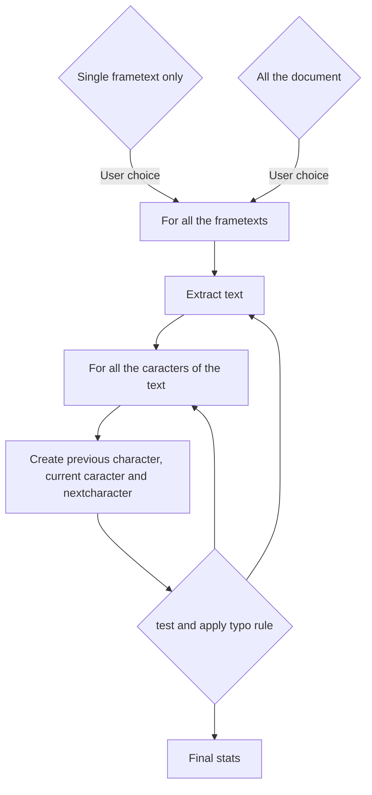

# Dev documentation

External doc for typoImprimerieNationale.py

This script has an internal documentation, but it could be a nice idea to read this documentation before for helping to understand the code.

You must be fluent with the Scribus API and Python.

# Internal code

## General principle

The general principle of this script is:



## Internal code

This script is based on the general Scribus structure template script you can find here:

https://wiki.scribus.net/canvas/Scripter/Snippet/Main

The script deals only on **frametext** and let the user to choose between working on a single frametext or on all over the document. This is enough difficult to propose an average, because Scribus API dialog structure is poor for dealing chooses. 

If the user choose a single frametext, he must have selected it before using the script.

The `setup_script()` code checks it.

```python
    while True:
        message_setup = """<center>Appliquer la typographie</center>
        <ul> 1 : sur une zone de texte (à sélectionner à la souris auparavant)</ul>
        <ul> 2: sur tout le document (choix par défaut)</ul>
        <ul> 0 : pour quitter le processus</ul>"""
        flow = scribus.valueDialog("Domaine d'application", message_setup, "2")
        if flow == "2":
            workflow = "page"
            break
        if flow == "1":
            workflow = "frametext"
            break
        if flow == "0":
            sys.exit(1)
        else:
            message_warn = """<center>Vous devez répondre par 1 (zone de texte) <br>
            ou 2 (tout le document)</center>"""
            scribus.messageBox("Information",
                               message_warn,
                               icon=ICON_WARNING,
                               button1=BUTTON_OK)
```

Because the dialog boxes are poored, you cannot have check-button or all this sort of easy-to-configure buttons.
